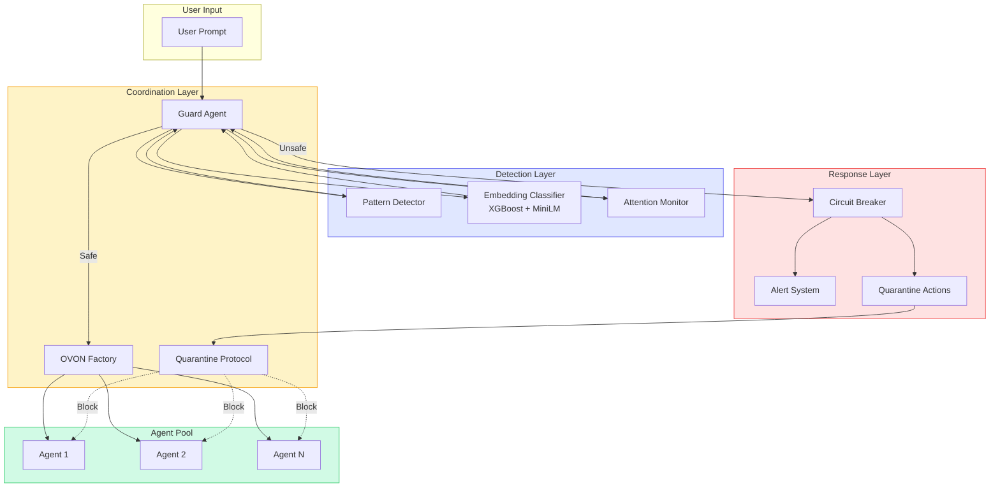

```mermaid
flowchart TB
    subgraph Input["User Input"]
        U[User Prompt]
    end
    
    subgraph Detection["Detection Layer"]
        direction LR
        P[Pattern Detector]
        E[Embedding Classifier<br/>XGBoost + MiniLM]
        A[Attention Monitor]
    end
    
    subgraph Coordination["Coordination Layer"]
        G[Guard Agent]
        Q[Quarantine Protocol]
        OF[OVON Factory]
    end
    
    subgraph Response["Response Layer"]
        CB[Circuit Breaker]
        AL[Alert System]
        QA[Quarantine Actions]
    end
    
    subgraph Agents["Agent Pool"]
        A1[Agent 1]
        A2[Agent 2]
        A3[Agent N]
    end
    
    U --> G
    G --> P & E & A
    P & E & A --> G
    G -->|Safe| OF
    G -->|Unsafe| CB
    CB --> AL
    CB --> QA
    QA --> Q
    OF --> A1 & A2 & A3
    Q -.->|Block| A1 & A2 & A3
    
    style Detection fill:#e0e7ff,stroke:#6366f1
    style Coordination fill:#fef3c7,stroke:#f59e0b
    style Response fill:#fee2e2,stroke:#ef4444
    style Agents fill:#d1fae5,stroke:#22c55e
```