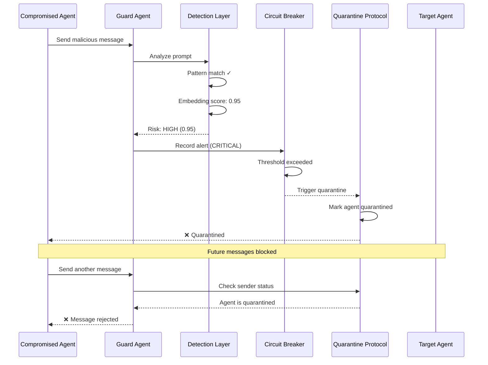

```mermaid
sequenceDiagram
    participant Bad as Compromised Agent
    participant Guard as Guard Agent
    participant Detect as Detection Layer
    participant Circuit as Circuit Breaker
    participant Q as Quarantine Protocol
    participant Target as Target Agent
    
    Bad->>Guard: Send malicious message
    Guard->>Detect: Analyze prompt
    Detect->>Detect: Pattern match ✓
    Detect->>Detect: Embedding score: 0.95
    Detect-->>Guard: Risk: HIGH (0.95)
    Guard->>Circuit: Record alert (CRITICAL)
    Circuit->>Circuit: Threshold exceeded
    Circuit-->>Q: Trigger quarantine
    Q->>Q: Mark agent quarantined
    Q-->>Bad: ❌ Quarantined
    
    Note over Bad,Target: Future messages blocked
    
    Bad->>Guard: Send another message
    Guard->>Q: Check sender status
    Q-->>Guard: Agent is quarantined
    Guard-->>Bad: ❌ Message rejected
```